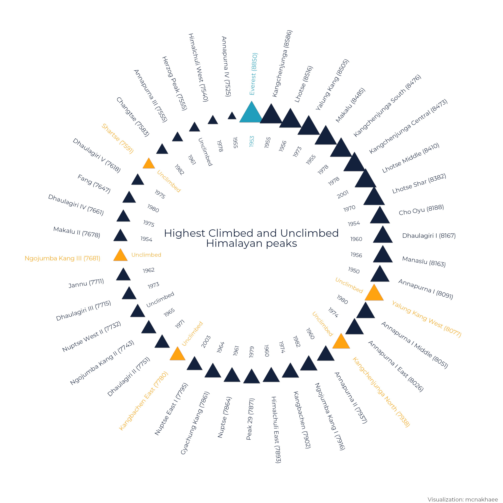
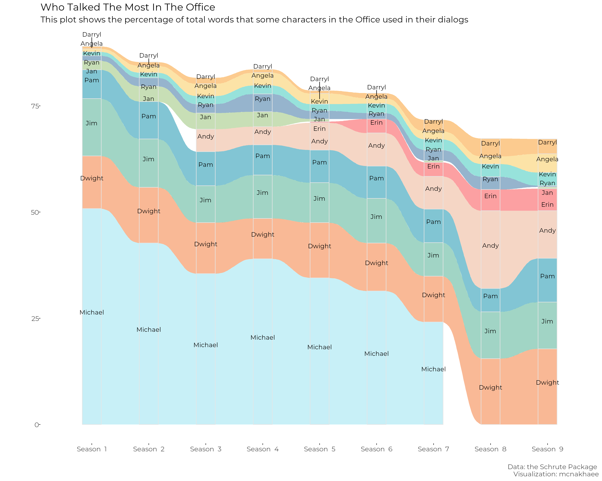
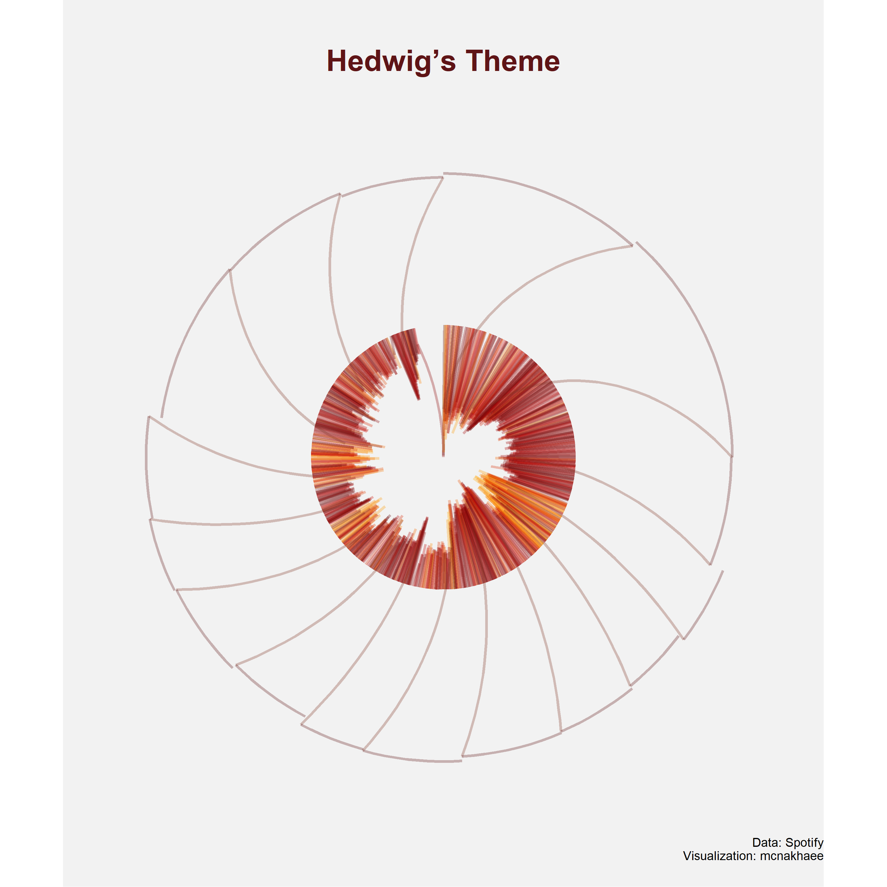
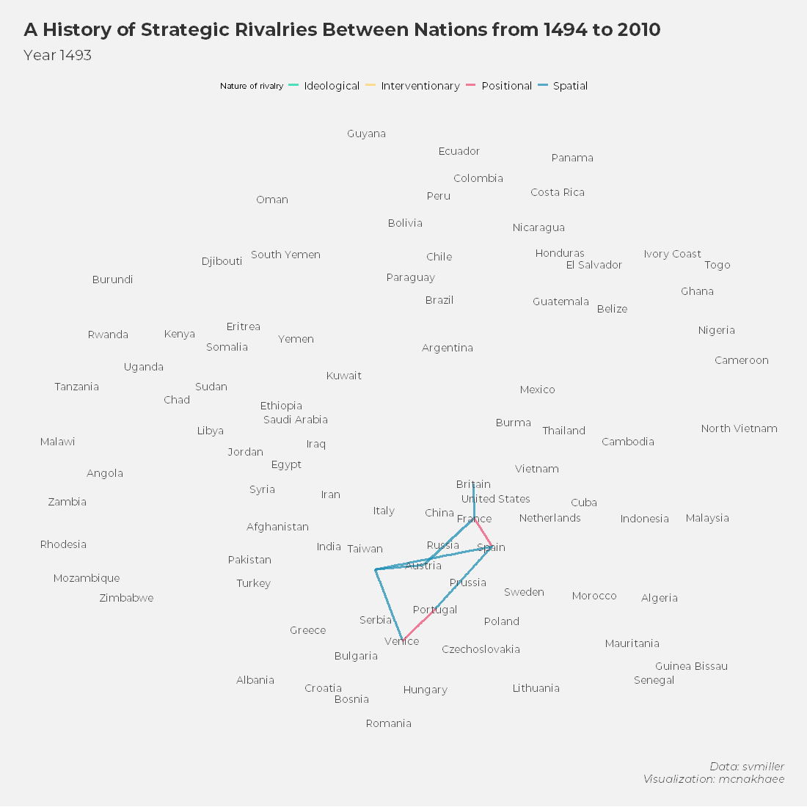

<!-- README.md is generated from README.Rmd. Please edit that file -->

```{r, include = FALSE}
knitr::opts_chunk$set(
  collapse = TRUE,
  comment = "#>"
)
```

# My submission for the 30dayChartChallenge

<!-- badges: start -->
<!-- badges: end -->

### Day 6: Experimental

```{r echo=FALSE}

```


### Day 5: Slope

```{r echo=FALSE}

```


### Day 4: Magical
```{r echo=FALSE}

```


### Day 3: Historical
```{r echo=FALSE}

```

