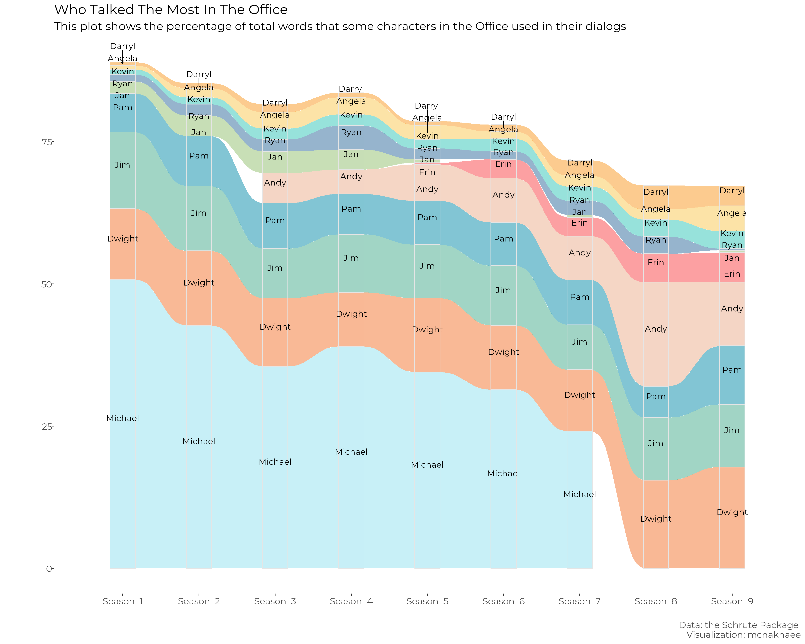
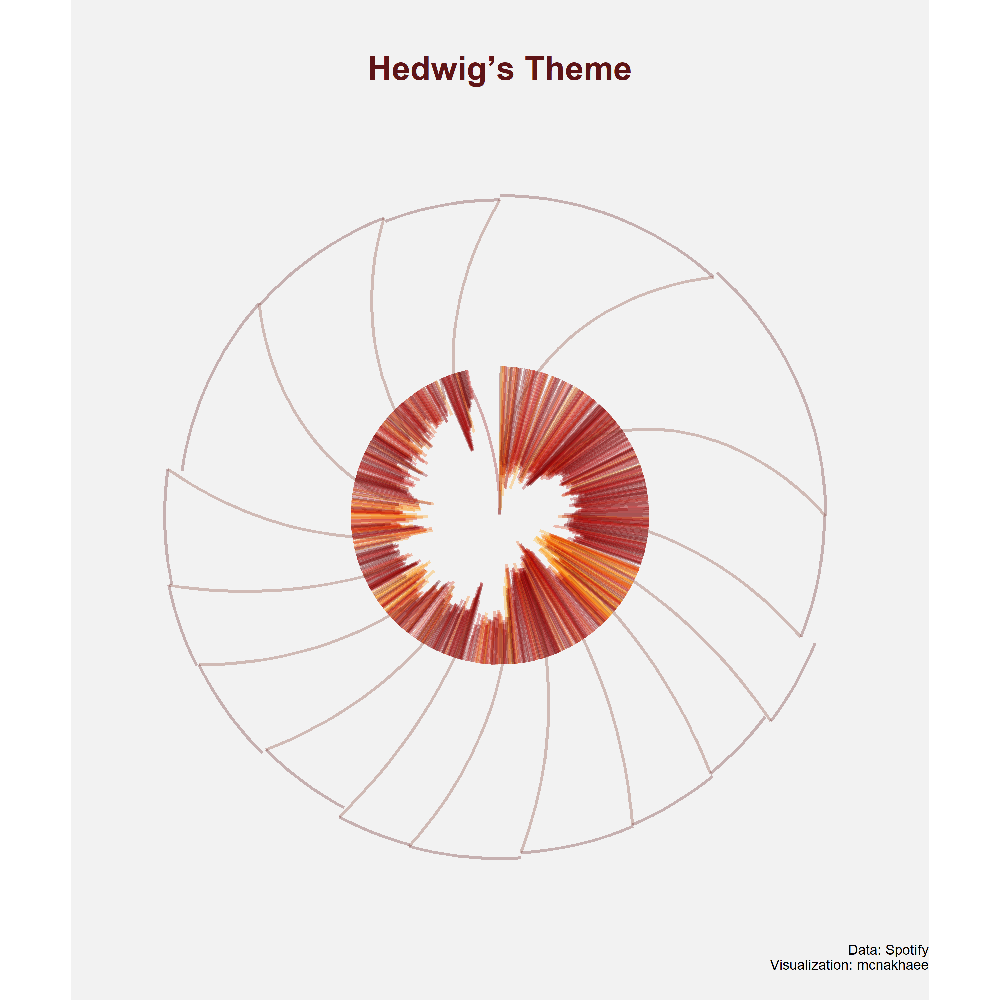

<!-- README.md is generated from README.Rmd. Please edit that file -->

# My submission for the 30dayChartChallenge

<!-- badges: start -->
<!-- badges: end -->

### Day 6: Experimental

### Day 5: Slope

### Day 4: Magical

### Day 3: Historical

<!-- -->
